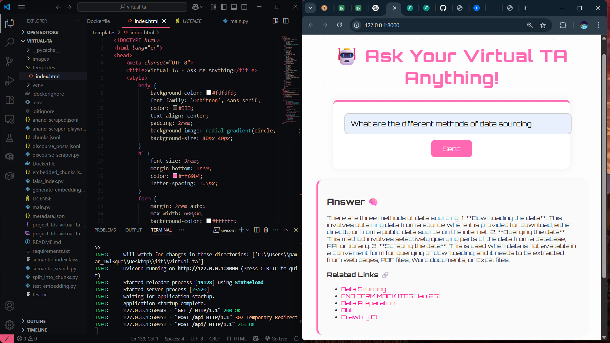
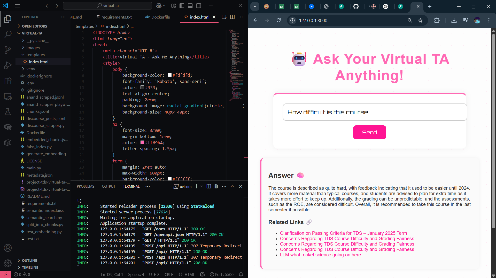
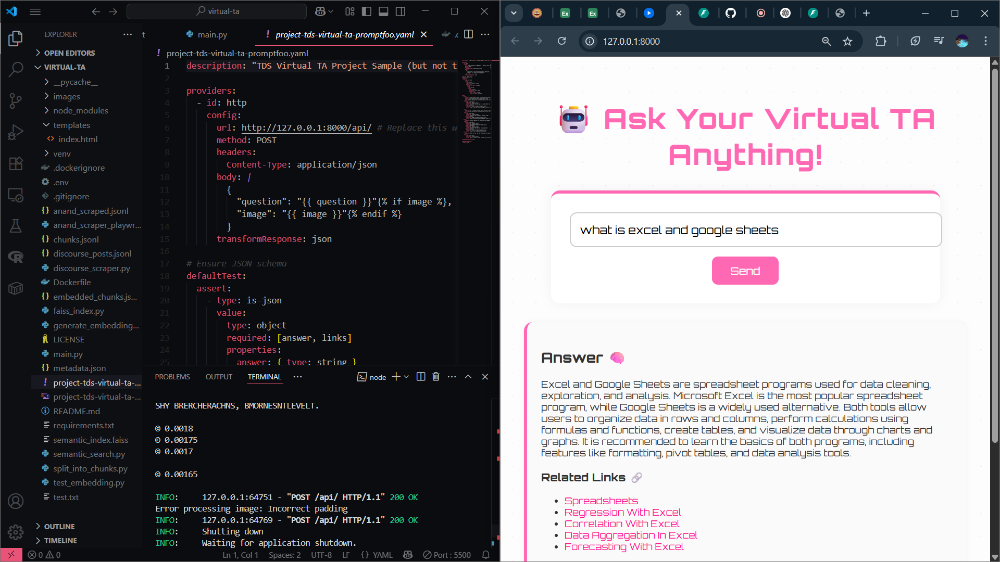

---
# 🤖 Virtual TA — Teaching Assistant Automation with FastAPI + Promptfoo

A lightweight, AI-powered **Virtual Teaching Assistant** built using **FastAPI**, designed to answer questions from a course discussion forum and lecture content. This tool supports semantic search, vector-based embeddings, and intelligent responses — perfect for automating TA tasks for university-level courses.

---

## 🚀 Features

- ✅ **Semantic Search** over lecture and forum content  
- 🧠 **LLM-powered Answers** based on question context  
- 📦 **FastAPI backend** for efficient API serving  
- 🌐 **Promptfoo integration** for prompt evaluation  
- 🔍 **Vector similarity matching** using sentence embeddings  
- 📂 Easily customizable with your own course data  

---

## 📁 Project Structure

```

virtual-ta/
├── .env                            # Environment variables
├── .gitignore                     # Git ignore rules
├── anand_scraped.jsonl            # Scraped lecture data
├── anand_scraper_playwright.py    # Scraper for lecture content
├── chunks.jsonl                   # Text chunks for embedding
├── discourse_posts.jsonl          # Scraped forum discussions
├── discourse_scraper.py           # Scraper for discourse posts
├── embedded_chunks.jsonl          # File containing vector embeddings
├── faiss_index.py                 # FAISS indexing logic
├── generate_embeddings.py         # Embedding generation script
├── LICENSE                        # License info
├── main.py                        # FastAPI app entry point
├── metadata.json                  # Metadata for chunks
├── project-tds-virtual-ta-promptfoo.yaml  # Promptfoo evaluation config
├── project-tds-virtual-ta-q1.webp         # Project illustration image
├── README.md                      # Project documentation
├── requirements.txt               # Python dependencies
├── semantic_index.faiss          # Saved FAISS index
├── semantic_search.py            # Vector similarity logic
├── split_into_chunks.py          # Script to split documents into chunks
├── structure.txt                 # File structure outline
├── test.txt                      # Testing input
├── test_embedding.py             # Test embedding code
├── images/                       # Screenshots & demo images
│   ├── api-demo1.png
│   ├── api-demo2.png
│   └── api-demo3.png

````

---

## ⚙️ Setup Instructions

### 1. Clone the Repository

```bash
git clone https://github.com/PranathiPamarti/virtual-ta-project.git
cd virtual-ta-project
````

### 2. Install Dependencies

Ensure you have Python 3.9+ installed, then run:

```bash
pip install -r requirements.txt
```

### 3. Start the FastAPI Server

```bash
uvicorn main:app --reload
```

Visit `http://127.0.0.1:8000/docs` for the interactive API docs.

---

## 📬 How to Use

### Endpoint: `POST /api`

Send a JSON body like:

```json
{
  "question": "TDS course requirements to pass",
  "image": "https://example.com/image.png"  // optional
}
```

Example response:

```json
{
  "answer": "Average for 4/5 graded assignments should be more than 40/100"
}
```

Or test directly from Swagger UI at:
📍 `http://localhost:8000/docs`

SCREENSHOTS








---

## 🧪 Promptfoo Evaluation

Evaluate your question-answer quality using [Promptfoo](https://promptfoo.dev):

```bash
npx promptfoo eval -c tests/project-tds-virtual-ta-promptfoo.yaml
```

Promptfoo will send test questions to your FastAPI endpoint and display the results in a tabular format.

---

## 💡 How It Works

1. The data is embedded using `sentence-transformers`.
2. A question is received via API.
3. Semantic similarity is computed with existing data.
4. The most relevant context is sent to a language model (LLM).
5. A concise, contextual answer is returned.

---

## 🛠 Tech Stack

* **Python 3.10**
* **FastAPI** & **Uvicorn**
* **sentence-transformers**
* **Promptfoo**
* **OpenAI-compatible LLM proxy**

---

## 👩‍💻 Author

**Pranathi Pamarti**
🔗 GitHub: [@PranathiPamarti](https://github.com/PranathiPamarti)

---

## 🙌 Acknowledgements

* TDS course inspiration @ MIT Manipal
* Data from Anand Sir (scraped lectures + forum)
* Backed by open-source AI & developer tools
